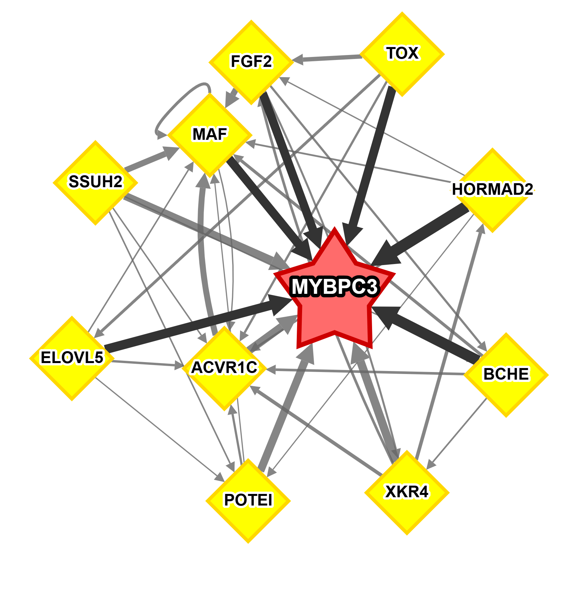
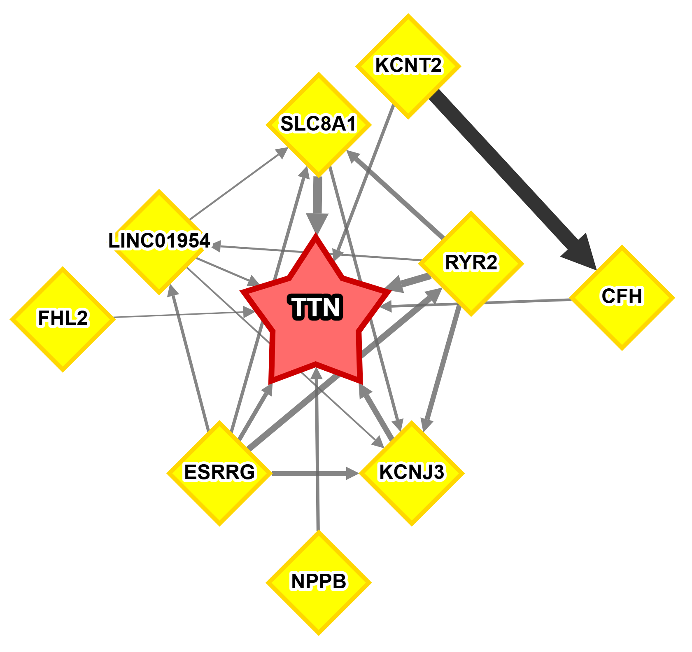

# Target-Centered Subnetwork Visualization

A Python script for visualizing target-centered subnetworks from Gene Regulatory Networks (GRNs). This tool helps researchers explore regulatory relationships by focusing on a specific target gene and its top regulatory transcription factors (TFs).

## Overview

This script:
1. Loads GRN data from CSV or H5AD (GRnnData) files
2. Selects a target gene of interest
3. Finds the top N TFs (default: 10) with highest connection scores to the target
4. Identifies all connections between these TFs
5. Visualizes the subnetwork interactively using Dash Cytoscape

## Features

- **Interactive Visualization**: Web-based network visualization with multiple layout options
- **Multiple Input Formats**: Supports both CSV and H5AD (GRnnData) file formats
- **Customizable**: Adjust the number of TFs to include in the subnetwork
- **Export Options**: Export visualizations as PNG or SVG
- **Node Information**: Click on nodes to see detailed information about TFs and targets

## Installation

### Prerequisites

```bash
pip install pandas numpy networkx dash dash-cytoscape
```

### For H5AD/GRnnData Support

If you plan to use H5AD files (GRnnData format), you'll also need:

```bash
pip install grnndata anndata
```

For more information about GRnnData, visit: [https://github.com/cantinilab/GRnnData](https://github.com/cantinilab/GRnnData)

## Input File Formats

### CSV Format

The CSV file should contain at least the following columns:
- **TF**: Transcription factor name (source node)
- **Target**: Target gene name (target node)
- **Correlation** (or **Weight**/**weight**): Edge weight/correlation score

**Example CSV structure:**
```csv
TF,Target,Correlation
GPAM,PLIN1,0.7551681957664862
PCDH7,LINC02388,0.7512383764744354
TMEM52,CLDN9,0.7347509538461005
ADIPOQ,PLIN1,0.7210295520219351
```

**Note**: If a `Correlation` column is not present, the script will look for `Weight` or `weight` columns. If none are found, all edges will be assigned a weight of 1.0.

### H5AD Format (GRnnData)

The H5AD file should be in GRnnData format, which stores the GRN adjacency matrix in the `.varp['GRN']` attribute or `.grn` attribute. The script automatically detects and extracts the GRN matrix from the file.

For more details about GRnnData format and how to create GRNAnnData objects, see the [GRnnData documentation](https://github.com/cantinilab/GRnnData).

**Key requirements for H5AD files:**
- Must contain a GRN adjacency matrix in `varp['GRN']` or `grn` attribute
- Gene names should be stored in `var_names`
- The adjacency matrix should be square (N×N) where N is the number of genes

## Usage

### Basic Usage

Visualize a subnetwork for a target gene using the default CSV file:

```bash
python visualize_target_subnetwork.py --target-gene TTN
```

### Using H5AD File

Visualize a subnetwork from an H5AD (GRnnData) file:

```bash
python visualize_target_subnetwork.py --target-gene MYBPC3 --grn-file example_inputs/heart_failure_grn_scprint.h5ad
```

### Using CSV File

Visualize a subnetwork from a CSV file:

```bash
python visualize_target_subnetwork.py --target-gene TTN --grn-file example_inputs/grn_heart_failure_pyscenic.csv
```

### Customizing Number of TFs

Specify the maximum number of TFs to include in the subnetwork:

```bash
python visualize_target_subnetwork.py --target-gene PLIN1 --grn-file example_inputs/grn_heart_failure_pyscenic.csv --max-tfs 15
```

### Command-Line Arguments

```
--grn-file          Path to the GRN file (CSV or H5AD format)
                    Default: example_inputs/grn_heart_failure_pyscenic.csv

--target-gene       Target gene name to create a centered subnetwork (required)

--max-tfs           Maximum number of TFs to include (default: 10)
```

## Visualization Features

Once the script starts, it will:
1. Open a web browser at `http://127.0.0.1:8050/`
2. Display an interactive network visualization with:
   - **Target gene**: Shown as a red star in the center
   - **Transcription factors**: Shown as yellow diamonds
   - **Edges**: Directed arrows showing regulatory relationships, with thickness indicating connection strength

### Interactive Features

- **Layout Selection**: Choose from multiple layout algorithms:
  - Concentric (default, good for target-centered networks)
  - Cose (Force-directed)
  - Circle
  - Grid
  - Breadthfirst
  - Cose-Bilkent (Best for large networks)
  - Euler
  - Spread
  - Dagre (Hierarchical)
  - Klay (Hierarchical)

- **Node Information**: Click on any node to see:
  - For target genes: List of regulating TFs
  - For TFs: List of targets in the subnetwork

- **Export Options**: 
  - Export as PNG (high-resolution)
  - Export as SVG (vector format)

## Example Visualizations

### Example 1: MYBPC3 Subnetwork (from H5AD file)

Visualization of the MYBPC3-centered subnetwork generated from a GRnnData H5AD file:



**Command used:**
```bash
python visualize_target_subnetwork.py --target-gene MYBPC3 --grn-file example_inputs/heart_failure_grn_scprint.h5ad
```

This visualization shows:
- **MYBPC3** (red star) as the central target gene
- Top transcription factors (yellow diamonds) that regulate MYBPC3
- Connections between TFs, showing the regulatory network structure
- Edge thickness indicates the strength of regulatory relationships

### Example 2: TTN Subnetwork (from CSV file)

Visualization of the TTN-centered subnetwork generated from a CSV file:



**Command used:**
```bash
python visualize_target_subnetwork.py --target-gene TTN --grn-file example_inputs/grn_heart_failure_pyscenic.csv
```

This visualization demonstrates:
- **TTN** (red star) as the central target gene
- Top transcription factors (yellow diamonds) with strong regulatory connections to TTN
- Bidirectional and unidirectional regulatory relationships
- Network topology showing how TFs interact with each other

## Output

The script generates an interactive web-based visualization. The visualization can be:
- Viewed in your web browser
- Exported as PNG or SVG using the export buttons in the interface
- Interacted with (zoom, pan, click nodes for details)

## Troubleshooting

### Common Issues

1. **"No TFs found that regulate [gene]"**
   - Check that the target gene name matches exactly (case-insensitive)
   - Verify the gene name exists in your GRN data
   - The script will show available target genes if the specified gene is not found

2. **"GRnnData package not installed"**
   - Install with: `pip install grnndata`
   - Only required if using H5AD files

3. **"dash and dash-cytoscape are not installed"**
   - Install with: `pip install dash dash-cytoscape`

4. **Empty or sparse network**
   - Try increasing `--max-tfs` to include more TFs
   - Check that your GRN file contains edges with sufficient correlation/weight values
   - The script filters out edges with |correlation| < 0.0001

## References

- **GRnnData**: [https://github.com/cantinilab/GRnnData](https://github.com/cantinilab/GRnnData) - GRN enhanced AnnData toolkit
- **Dash Cytoscape**: [https://dash.plotly.com/cytoscape](https://dash.plotly.com/cytoscape) - Interactive network visualization
- **NetworkX**: [https://networkx.org/](https://networkx.org/) - Network analysis library

## License

This script is provided as-is for research purposes.

